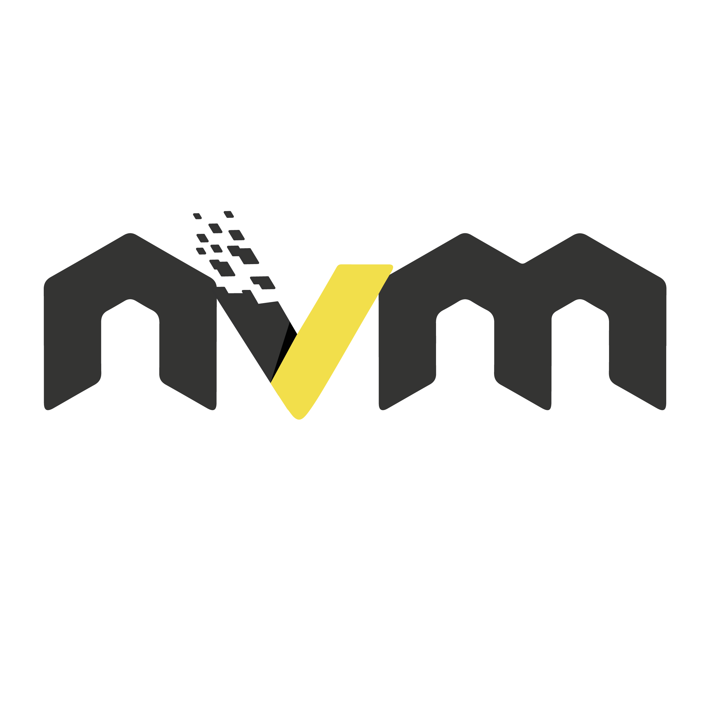

<p align="center">
    
</p>

# ⚡Vite + Electron


## How to use

- In the project folder:
  ```bash
  # install dependencies
  yarn # npm install

  # run in developer mode
  yarn dev # npm run dev

  # build
  yarn build # npm run build
  ```